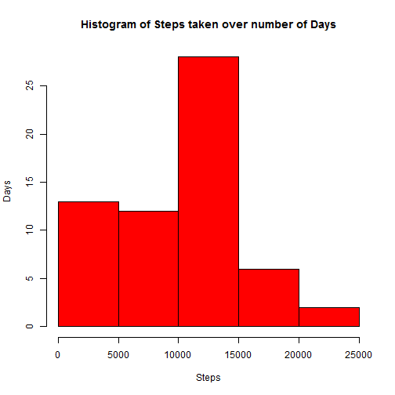
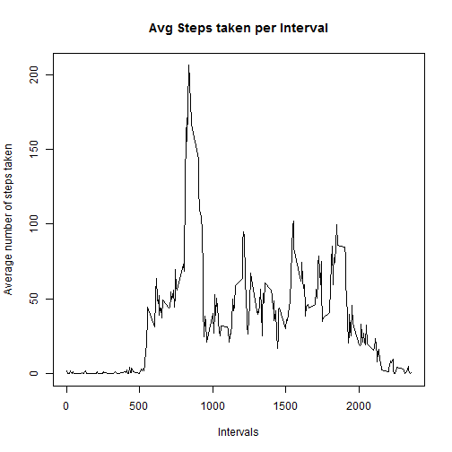
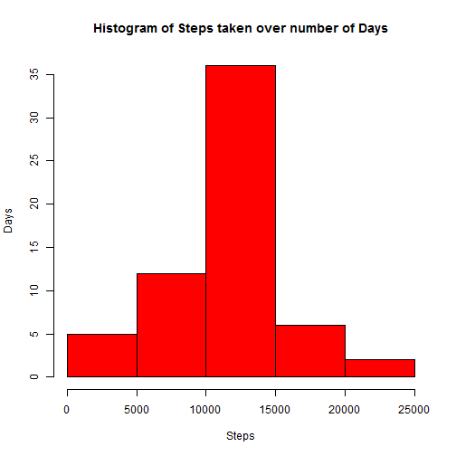

This is an R Markdown document. This document describes the results of the PeerAssessment 1 of the Reproducible Research course of Data Science Specialization.

Change the Working Directory

```r
setwd("C:\\Users\\Sriram\\Documents\\RData\\repdata")
```

Load the activity.csv file into a variable

```r
data <- read.csv(file = 'activity.csv', stringsAsFactors = FALSE)
```

Aggregate the data and find the total number of steps based on the dates

```r
histData <- aggregate(data$steps,by=list(Date = data$date),sum,na.rm=TRUE)
```

Plot the Histogram of the total number of steps over the number of days

```r
hist(histData$x, xlab= 'Steps', ylab= 'Days', col= 'Red', main= 'Histogram of Steps taken over number of Days')
```

 

After the addition of the missing values it is seen that the average total number of steps has steped down as the number of steps in the first few days have increased but decreased the average overall.

Find the mean and median of steps taken based on the dates

```r
meanData <- histData[histData$x != 0,]
Mean <- mean(meanData$x)
Median <- median(meanData$x)
print(paste('Mean of total number of steps =',Mean,sep=" "))
```

```
## [1] "Mean of total number of steps = 10766.1886792453"
```

```r
print(paste('Median of total number of steps =',Median,sep=" "))
```

```
## [1] "Median of total number of steps = 10765"
```

Average Number of steps taken for each and every 5 minute interval

```r
filterData <- data[complete.cases(data),]
avgData <- aggregate(filterData$steps,by=list(Interval = filterData$interval),mean)
plot(avgData$Interval,avgData$x,type='l',xlab='Intervals',ylab='Average number of steps taken',main='Avg Steps taken per Interval')
```

 

```r
MaxAvgInterval = avgData[avgData$x == max(avgData$x),1]
print(paste('Largest Average Interval is ',MaxAvgInterval,sep=''))
```

```
## [1] "Largest Average Interval is 835"
```

NA rows in the dataset

```r
NAdata <- data[!complete.cases(data),]
print(paste('Total Number of NA rows is', nrow(NAdata), sep=' '))
```

```
## [1] "Total Number of NA rows is 2304"
```

Filling up of the NA values based on averages of the interval. The strategy used here, is to gather the average for each interval and then use that average to input the missing values. In this case the decimal averages have been rounded off owing to an increase or decrease in the averages. This round off has been done as the number of steps cannot be an integer value

```r
newData <- data
intervals <- unique(NAdata$interval)
for (i in (1:length(intervals))) {
 newData[newData$interval==intervals[i] & is.na(newData$steps)==TRUE,1] = round(avgData[avgData$Interval==intervals[i],2])
}
```

Aggregate the data and find the total number of steps based on the dates

```r
newhistData <-aggregate(newData$steps,by=list(Date = newData$date),sum)
```

Plot the Histogram of the total number of steps over the number of days

```r
hist(newhistData$x, xlab= 'Steps', ylab= 'Days', col= 'Red', main= 'Histogram of Steps taken over number of Days')
```

 

Find the mean and median of steps taken based on the dates

```r
newMeanData <- newhistData[newhistData$x != 0,]
newMean <- mean(newMeanData$x)
newMedian <- median(newMeanData$x)
print(paste('Mean of total number of steps =',newMean,sep=" "))
```

```
## [1] "Mean of total number of steps = 10765.6393442623"
```

```r
print(paste('Median of total number of steps =',newMedian,sep=" "))
```

```
## [1] "Median of total number of steps = 10762"
```

Classify the days as weekend and weekday

```r
newData$Day <- weekdays(as.Date(newData[,2]))
newData[newData$Day == 'Saturday' | newData$Day == 'Sunday',5] = 'Weekend'
newData[!(newData$Day == 'Saturday' | newData$Day == 'Sunday'),5] = 'Weekday'
names(newData) <- c('steps','date','interval','Day','Week')
newData$Week <- as.factor(newData$Week)
newAvgData <- aggregate(newData$steps,by=list(Interval = newData$interval, Week = newData$Week),mean)
par(mfrow=c(2,1))
plot(newAvgData[newAvgData$Week == 'Weekend',1], newAvgData[newAvgData$Week == 'Weekend',3], type ='l', xlab = 'Interval', ylab = 'Number of steps', main = 'Weekend', col='Red')
plot(newAvgData[newAvgData$Week == 'Weekday',1], newAvgData[newAvgData$Week == 'Weekday',3], type ='l', xlab = 'Interval', ylab = 'Number of steps', main = 'Weekday', col='Blue')
```

 

There is a subsequent increase in the number of steps, over the farther end of the intervals over the weekend than that compared over the weekdays.
